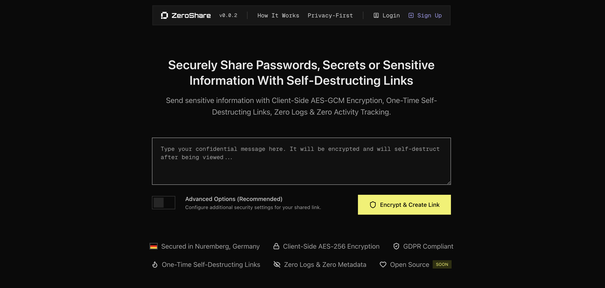

# ZeroShare

Securely Share Passwords, Secrets or Sensitive Information With Self-Destructing Links.
Send sensitive information with Client-Side AES-GCM Encryption, One-Time Self-Destructing Links, Zero Logs & Zero Activity Tracking.



[Visit Website](https://zeroshare.io)

## Selfhosted

ZeroShare can be easily self-hosted for your organization or personal use. The following one-liner will guide you through a secure production setup, generating all required secrets and configuration files interactively. SSL certificates are generated automatically during setup.

### Requirements

- Docker installed on your server or VM ([Docker Docs](https://docs.docker.com/get-docker/))
- curl installed (`sudo apt update && sudo apt install curl -y`)
- Any VM or server (cloud or on-prem, e.g. [Hetzner](https://www.hetzner.com/cloud))
- A public domain name already pointing to your VM/server's IP address (DNS should be set up before running quickstart, e.g. from [Porkbun](https://porkbun.com))

### Installation

```sh
curl -fsSL https://raw.githubusercontent.com/zerosharelabs/zeroshare/refs/heads/main/quickstart.sh | bash
```

## License

This project is licensed under the [AGPL-3.0](https://opensource.org/licenses/AGPL-3.0) for non-commercial use.

### Commercial Use

For commercial use or deployments requiring a setup fee, please contact us
for a commercial license at [business@zeroshare.io](mailto:business@zeroshare.io).

By using this software, you agree to the terms of the license.
